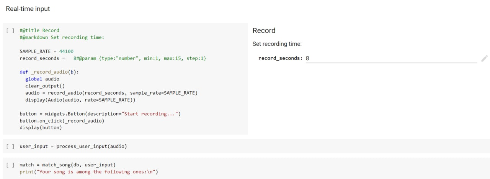

# QTune (cuty tune ^^)

## About The Project
This is the semester project for LA course at UCU with signal processing as the general topic. MiniShazam(change later) is a simplified version of a query-by-humming (QBH) system. The developed framework takes in a piece of a hummed or whistled song as an input parameter for a search system and outputs the matching song in its full version.

The user can hum a piece of tune into a microphone of his computer or laptop for arbitrary number of seconds (we recommend 8). The program will perform necessary evaluation and search a database of tunes to find a list of melodies that are most similar to the user’s “query”. Then he/she will be able to listen to this result to see if it is actually the tune that he/she had in mind. If the recording has drastically different tempo, the user will be asked to hum again, this time more accurately. 

The database of tunes can be extended by manually adding new songs. If the user hums or whistles a piece that is not yet in the database, the system, apparently, will not be able to return the exact match. 

### Built With

* [Python](https://www.python.org/)
* [Essentia](https://essentia.upf.edu/)
* [SciPy](https://scipy.org/)
* [Librosa](https://pypi.org/project/librosa/)


## Getting Started

### Prerequisites
* essentia
    ```shell
    pip install essentia
    ```
* mir_eval
    ```shell
    pip install mir_eval
    ```
* pydub
    ```shell
    pip install pydub
    ```

## Usage
1. Open Google Colab by clicking [here](https://colab.research.google.com/drive/1H4XjO4dirmbNFZoXEVPPbxxmYaVJY1UD?usp=sharing)
2. Make a copy of this notebook
3. Upload the desired songs, form a lists of path to them, form a database by using `create_database` function
4. Record your input and test the program in the `Testing -> Real-time` section of the notebook!

Record, process and match here:



## Roadmap

- [x] Implement pitch detection algorithm
- [x] Implement real-time recording
- [x] Implement matching algorithm
- [x] Test the program
  - [x] Test on different music genres
  - [x] Test on the bad quality input
  - [x] Test on the input that is absent in the database
    

## Contributors
- [Alina Muliak](https://github.com/alinamuliak)
- [Vira Saliieva](https://github.com/vsaliievaa)
